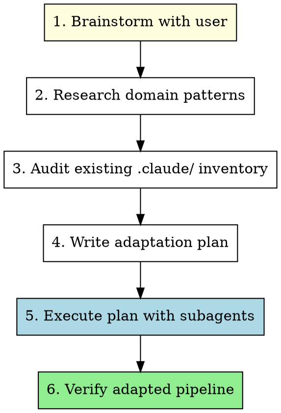

# Adapting Claude Pipeline to a Codebase

## Overview

Adapt the generic `.claude/` pipeline folder to a specific project's tech stack, domain, and workflows. This means modifying, replacing, or removing every skill, agent, hook, script, prompt, and setting so they serve the target codebase — not the original Laravel/web template.

**Core principle:** Every file in `.claude/` must earn its place. If it doesn't serve the target project, delete it. If it needs modification, modify it. If new capabilities are needed, create them.

## When to Use

- Cloning the claude-pipeline repo into a new project
- Onboarding an existing codebase with the generic `.claude/` folder
- Switching tech stacks (e.g., Laravel to Python, web to CLI, monolith to microservices)

## The Process



---

### Phase 1: Brainstorm

**REQUIRED:** Use the `brainstorming` skill to explore the target project.

Focus questions on:
- **Tech stack:** Language, framework, database, infrastructure
- **Project type:** Web app, CLI tool, library, API, microservice, data pipeline, etc.
- **Team workflows:** CI/CD, code review, deployment, testing patterns
- **Pain points:** What does the team struggle with that agents could help?
- **Existing tooling:** Linters, formatters, test runners, build systems
- **Scope:** Full adaptation or partial (e.g., keep orchestration, replace agents)?

Key decisions to reach:
1. Which existing skills/agents/hooks are **relevant** (keep/modify)?
2. Which are **irrelevant** (delete)?
3. What **new** capabilities does the project need?
4. What domain-specific best practices should agents follow?

### Phase 2: Research Domain Patterns

**Use WebSearch to investigate the target project's domain.** This feeds directly into agent definitions and skill content.

Search for:
```
"[language/framework] best practices [current year]"
"[language/framework] anti-patterns"
"[language/framework] code review checklist"
"[language/framework] common mistakes"
"[language/framework] testing best practices"
"[language/framework] security considerations"
"[language/framework] project structure conventions"
"[tool/framework] CI/CD pipeline best practices"
```

**Capture findings as notes** — they will be incorporated into:
- Agent anti-patterns sections
- Skill content (technique skills)
- Hook logic (formatting, linting)
- Orchestration script stages

### Phase 3: Audit Existing Inventory

Categorize every `.claude/` file into one of four buckets:

| Bucket | Action | Example |
|--------|--------|---------|
| **Keep as-is** | Universal process skills | brainstorming, writing-plans, TDD, systematic-debugging |
| **Modify** | Adapt to new tech stack | implement-issue (change test commands), agents (change domain) |
| **Replace** | Same purpose, different implementation | laravel-backend-developer → python-backend-developer |
| **Delete** | Irrelevant to target project | bulletproof-frontend (for a CLI tool), write-docblocks (non-PHP) |

#### Inventory Checklist

**Skills (19 in template):**

| Skill | Category | Typical Decision |
|-------|----------|-----------------|
| brainstorming | Process | Keep as-is |
| bulletproof-frontend | Domain (web/CSS) | Delete if not web |
| dispatching-parallel-agents | Process | Keep as-is |
| executing-plans | Process | Keep as-is |
| handle-issues | Workflow (GitHub) | Keep if using GitHub Issues |
| implement-issue | Workflow (GitHub) | Keep if using GitHub Issues |
| investigating-codebase-for-user-stories | Process | Keep as-is |
| process-pr | Workflow (GitHub) | Keep if using GitHub PRs |
| review-ui | Domain (web/CSS) | Delete if not web |
| subagent-driven-development | Process | Keep as-is |
| systematic-debugging | Process | Keep as-is |
| test-driven-development | Process | Keep as-is |
| ui-design-fundamentals | Domain (web/CSS) | Delete if not web |
| using-git-worktrees | Process | Keep as-is |
| using-skills | Meta | Keep as-is |
| write-docblocks | Domain (PHP) | Replace with language-specific docblock skill |
| writing-agents | Meta | Keep as-is |
| writing-plans | Process | Keep as-is |
| writing-skills | Meta | Keep as-is |

**Agents (10 in template):**

| Agent | Category | Typical Decision |
|-------|----------|-----------------|
| bash-script-craftsman | Domain (bash) | Keep if project uses bash |
| bats-test-validator | Domain (bash) | Keep if project uses bash |
| bulletproof-frontend-developer | Domain (web) | Delete or replace |
| cc-orchestration-writer | Meta | Keep as-is |
| code-reviewer | Process | Modify (update tech stack refs) |
| code-simplifier | Domain (PHP) | Replace with language-specific |
| laravel-backend-developer | Domain (Laravel) | Replace with project-specific |
| phpdoc-writer | Domain (PHP) | Replace or delete |
| php-test-validator | Domain (PHP) | Replace with language-specific |
| spec-reviewer | Process | Keep as-is (tech-agnostic) |

**Hooks:**

| Hook | Typical Decision |
|------|-----------------|
| session-start.sh | Keep as-is (loads using-skills) |
| post-pr-simplify.sh | Modify (change PHP references) or delete |

**Settings (settings.json):**

| Setting | Typical Decision |
|---------|-----------------|
| PHP formatter (Pint) | Replace with project's formatter |
| Sensitive file protection | Modify patterns for project |
| Production deploy protection | Modify command for project |
| Desktop notifications | Keep as-is |

**Scripts:**

| Script | Typical Decision |
|--------|-----------------|
| implement-issue-orchestrator.sh | Modify (test commands, agents) |
| batch-orchestrator.sh | Modify (agent references) |
| JSON schemas | Modify if stages change |
| BATS tests | Modify to match script changes |

**Prompts:**

| Prompt | Typical Decision |
|--------|-----------------|
| frontend audit/refactor | Delete if not web, replace if different frontend |

### Phase 4: Write the Plan

**REQUIRED:** Use the `writing-plans` skill.

The plan should be organized into parallel workstreams where possible:

```
Workstream A: Delete irrelevant files (quick, no dependencies)
Workstream B: Modify existing files (parallel per file)
Workstream C: Create new skills (use writing-skills skill)
Workstream D: Create new agents (use writing-agents skill)
Workstream E: Modify orchestration scripts (use cc-orchestration-writer agent)
Workstream F: Update hooks and settings
```

Each task in the plan must specify:
- **File path** to create/modify/delete
- **What changes** and why
- **Which skill/agent** to use for the task (writing-skills, writing-agents, cc-orchestration-writer, etc.)
- **Dependencies** on other tasks (if any)

### Phase 5: Execute with Subagents

**REQUIRED:** Use the `subagent-driven-development` skill to execute the plan.

Route tasks to the correct agent/skill:

| Task Type | How to Execute |
|-----------|---------------|
| **Delete files** | Direct (no subagent needed) |
| **Modify existing skills** | Edit directly, following writing-skills patterns |
| **Create new skills** | Invoke `writing-skills` skill |
| **Modify existing agents** | Edit directly, following writing-agents patterns |
| **Create new agents** | Invoke `writing-agents` skill |
| **Modify orchestration scripts** | Dispatch `cc-orchestration-writer` agent via Task tool |
| **Modify hooks/settings** | Direct edit |
| **Create new hooks** | `bash-script-craftsman` agent via Task tool |

**Parallel execution:** Tasks in different workstreams with no shared files can run in parallel using `dispatching-parallel-agents`.

### Phase 6: Verify

After all modifications:

1. **File inventory check** — Glob `.claude/` and verify no orphaned or irrelevant files remain
2. **Cross-reference check** — Grep for references to deleted skills/agents/files and fix broken refs
3. **Settings validation** — Ensure settings.json hooks reference existing files and commands
4. **Skill description audit** — All skill descriptions match new project context
5. **Agent coordination audit** — Deferral relationships between agents are consistent
6. **Dry run** — Walk through a typical workflow (e.g., implement-issue) mentally to verify the pipeline makes sense

## Common Adaptation Patterns

### Web to CLI/Library

**Delete:** bulletproof-frontend, review-ui, ui-design-fundamentals, bulletproof-frontend-developer agent, all frontend prompts

**Replace:** laravel-backend-developer → language-specific developer agent

**Modify:** code-simplifier (change language), test validators (change framework)

### Laravel to Python/Django

**Replace:** laravel-backend-developer → django-backend-developer, php-test-validator → pytest-validator, code-simplifier → python code simplifier, write-docblocks → python docstring writer

**Modify:** settings.json (Pint → Black/Ruff), post-pr-simplify.sh (PHP → Python)

### Monolith to Microservices

**Add:** Service-specific agents, API contract validation skill, cross-service testing patterns

**Modify:** implement-issue workflow (multi-repo awareness), code-reviewer (service boundaries)

### Adding New Domain

**Add:** Domain-specific agents (ML engineer, data pipeline developer, etc.), domain testing skills

**Keep:** All process skills, orchestration infrastructure

## Red Flags

- **Keeping irrelevant skills** "just in case" — delete them. They add noise and confuse skill discovery.
- **Generic agent personas** — every agent should reference the actual project, its structure, and its conventions.
- **Orphaned references** — grep for deleted skill/agent names in remaining files.
- **Skipping web research** — domain patterns and anti-patterns are critical for agent quality.
- **Not updating settings.json** — stale hooks that reference missing tools will cause errors.

## Key Principles

- **Delete aggressively** — fewer, focused files beat a bloated pipeline
- **Research before writing** — WebSearch for domain patterns before creating agents/skills
- **Test the pipeline** — walk through a real workflow after adaptation
- **Use the meta-skills** — writing-skills and writing-agents exist to ensure quality; use them for new content
- **Preserve process skills** — brainstorming, TDD, debugging, planning are universal; don't delete these
