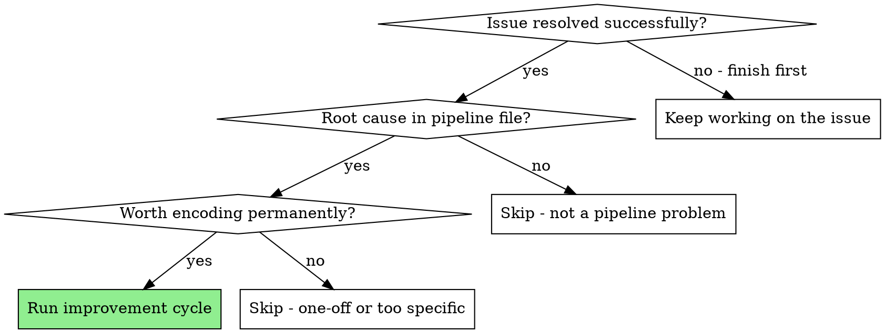
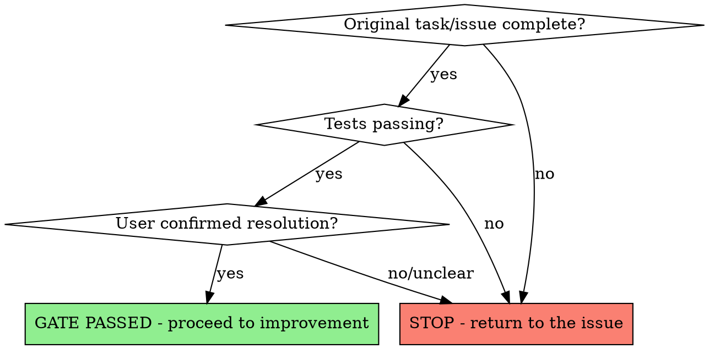

# The Improvement Loop

## Overview

Improve the `.claude/` pipeline **after** resolving the issue at hand — never during. When a skill, agent, hook, or script produces bad output, work through to the correct solution first, then update the pipeline with what you learned.

**Core principle:** Fix first, understand fully, improve last. Premature edits encode partial understanding.

## When to Use



**Trigger conditions (suggest to user):**
- An agent produced incorrect output that required manual correction
- A skill was missing guidance that caused a wrong approach
- The same mistake has occurred more than once across sessions
- A hook failed to catch something it should have
- An orchestration script hit an unhandled edge case
- A subagent asked questions that the agent definition should have answered
- Review feedback repeatedly flags the same class of issue

**Do NOT trigger:**
- While still debugging or iterating on the original issue
- For one-off problems unlikely to recur
- For issues outside the pipeline (user error, external service failures)
- When the fix is a code change, not a pipeline change

## The Gate: Is the Issue Resolved?

**This check is mandatory before any improvement work.**



Verify ALL of these before proceeding:
1. The original task or issue is **functionally complete**
2. All tests pass (or the fix is committed and verified)
3. The user considers the issue resolved (ask if unclear)

**If ANY check fails, stop.** Return to the issue. Do not start improvement work.

## Proactive Detection

When you observe improvement opportunities during normal work, **do not act immediately**. Instead:

1. **Note the opportunity** — mentally flag what went wrong and which pipeline file is involved
2. **Finish the current task** — complete whatever you're working on
3. **Ask the user** — suggest the improvement explicitly:

```
I noticed [specific problem] while working on [task]. The root cause appears to be
[skill/agent/hook/script name] which [lacks guidance on X / has an anti-pattern gap /
doesn't handle Y].

Would you like me to run an improvement cycle to update it? This would involve:
- [Specific change: e.g., "adding an anti-pattern entry for Model::all()"]
- [Estimated scope: e.g., "a one-line addition to the agent's anti-patterns section"]
```

**Always ask before starting.** The user may want to defer, batch improvements, or handle it differently.

## The Five-Step Cycle

### Step 1: Capture the Problem

Document what happened before details fade:
- **What went wrong:** The specific incorrect output or behavior
- **Which pipeline file:** The skill, agent, hook, or script involved
- **Root cause:** Why the pipeline file led to the wrong outcome
- **Correct solution:** What the right approach turned out to be
- **How you discovered it:** The debugging path (helps write better guidance)

### Step 2: Classify the Improvement

| Type | Target | Example |
|------|--------|---------|
| **Anti-pattern** | Agent definition | "NEVER use `Model::all()` on large tables" |
| **Missing guidance** | Skill content | Add edge case handling to a technique skill |
| **New trigger** | Skill description | Add symptom that should invoke this skill |
| **Hook gap** | settings.json / hook script | Formatter not catching a file type |
| **Script edge case** | Orchestration script | Unhandled timeout in a stage |
| **Missing skill** | New skill file | Technique not documented anywhere |
| **Missing agent** | New agent file | Specialized role not defined |

### Step 3: Make the Minimal Change

**Write the smallest change that prevents the problem from recurring.**

- Anti-pattern? Add one entry to the agent's anti-patterns section
- Missing guidance? Add one paragraph or code example to the skill
- Hook gap? Add one condition to the hook script
- Script edge case? Add one error handler to the orchestration script

**Do NOT:**
- Rewrite entire files while you're "in there"
- Add speculative guidance for problems that haven't occurred
- Refactor surrounding code that isn't related to the issue

### Step 4: Verify the Change

Depending on the type of change:

| Change Type | Verification |
|-------------|-------------|
| Agent anti-pattern | Grep for conflicting guidance in the agent file |
| Skill content | Read the skill end-to-end — does the new content fit? |
| Hook logic | Run the hook manually with test input |
| Orchestration script | Run relevant BATS tests |
| New skill/agent | Follow writing-skills or writing-agents skill (includes testing) |

### Step 5: Commit and Communicate

```
git add .claude/[changed-file]
git commit -m "improve: [file] - [what was added and why]"
```

Tell the user what was changed and why:
```
Updated [file] with [change]. This prevents [problem] which occurred during [task].
```

## Routing to the Right Tool

| What Needs Changing | How to Change It |
|---------------------|-----------------|
| **Existing skill** (small edit) | Edit directly |
| **Existing agent** (small edit) | Edit directly |
| **New skill** | Invoke `writing-skills` skill |
| **New agent** | Invoke `writing-agents` skill |
| **Orchestration script** | Dispatch `cc-orchestration-writer` agent via Task tool |
| **Hook script** | Dispatch `bash-script-craftsman` agent via Task tool |
| **settings.json** | Edit directly |

**For new skills and agents:** The writing-skills and writing-agents skills have their own TDD cycles. Follow them — don't shortcut.

## Preventing Improvement Drift

Improvements can spiral. Guard against these anti-patterns:

| Anti-Pattern | Prevention |
|--------------|-----------|
| **Yak shaving** — improving A leads to improving B leads to C... | One improvement per cycle. If you discover more, note them and ask the user about a separate cycle. |
| **Speculative improvements** — "while I'm here, let me also..." | Only fix the problem that actually occurred. YAGNI applies to pipeline improvements too. |
| **Encoding partial understanding** — improving before fully resolving | The gate check (Step 0) prevents this. Never skip it. |
| **Over-engineering** — turning a one-line anti-pattern into a new skill | Match the weight of the fix to the weight of the problem. |
| **Stale improvements** — guidance that was correct once but isn't anymore | When you notice outdated guidance during work, flag it as an improvement opportunity. |

## Batching Improvements

When multiple improvement opportunities arise in one session:

1. **Note each one** as you encounter it (don't act)
2. **Finish the current work** completely
3. **Present the batch to the user:**

```
I identified 3 potential pipeline improvements during this session:

1. [agent-name]: Missing anti-pattern for [X] (occurred during task Y)
2. [skill-name]: Edge case not covered for [Z] (caused wrong approach in task W)
3. [hook]: Not catching [file type] (missed formatting on 2 files)

Would you like me to address these? I can handle them as:
a) One batch (fastest, ~5 min)
b) Individual cycles (most thorough)
c) Skip for now
```

## Red Flags

- **Improving while the issue is unresolved** — STOP. Fix the issue first. This is the #1 violation.
- **Making changes without asking** — Always ask the user before starting improvement work.
- **Improving after a single occurrence** — One instance rarely justifies a pipeline change. Note it and watch for recurrence.
- **Rewriting instead of appending** — Most improvements are additions (anti-patterns, guidance, examples), not rewrites.
- **Skipping verification** — An untested improvement can introduce new problems.

## Key Insight

> "When a skill or agent produces bad output, don't immediately edit it. Work through to the correct solution first. Then update the skill with what you learned."

The instinct to jump into the pipeline file and tweak is strong. Resist it. Partial understanding encoded as guidance creates more problems than it solves. The improvement only becomes reliable after full resolution.
