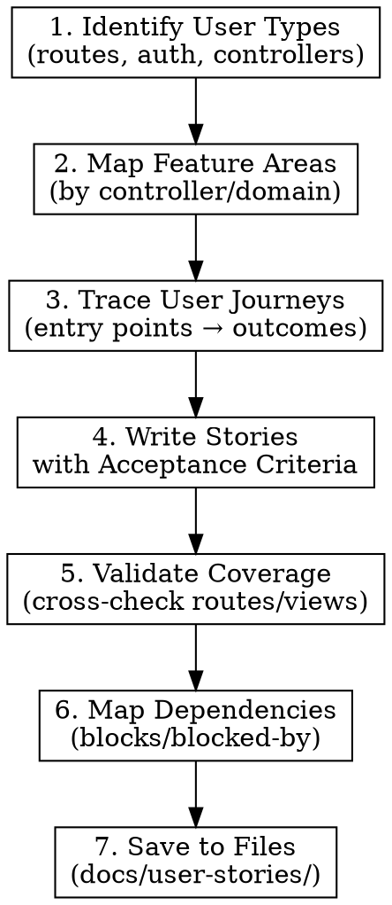
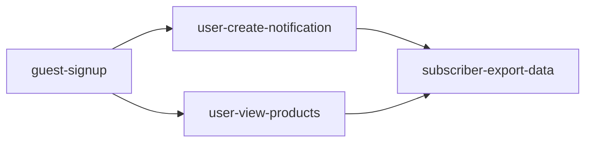

# Investigating Codebase for User Stories

## Overview

Systematic codebase investigation to produce well-formed user stories with acceptance criteria and traceability. Prevents shallow exploration that misses features or produces untestable stories.

## When to Use

- Asked to "create user stories from this codebase"
- Need to document existing features as stories
- Reverse-engineering requirements from implementation
- Onboarding to understand what a system does

## Investigation Phases



## Phase 1: Identify User Types

Investigate authentication and authorization to find distinct user types:

| Look In | What to Find |
|---------|--------------|
| Middleware | Auth guards, role checks, permission gates |
| Routes | Route groups with different middleware |
| User model | Roles, groups, subscription tiers |
| Views/layouts | Different dashboards, nav menus |

**Output:** List of user types (e.g., Guest, Registered User, Admin, Subscriber)

## Phase 2: Map Feature Areas

Group functionality by domain, not by file structure:

```
Feature Area          | Controllers/Services        | User Types
---------------------|-----------------------------|-----------
Authentication       | AuthController, MfaController| All
Product Catalog      | ProductController, SearchController| Registered+
Notifications        | NotificationController      | Subscriber+
Admin Management     | AdminController             | Admin
```

**Key locations to scan:**
- `routes/web.php`, `routes/api.php` - all endpoints
- `app/Http/Controllers/` - feature groupings
- `resources/views/` - UI capabilities
- Database migrations - data model capabilities

## Phase 3: Trace User Journeys

For each feature area, trace complete user journeys:

1. **Entry point** - How does user reach this feature?
2. **Actions available** - What can they do?
3. **State changes** - What data changes?
4. **Outcomes** - What feedback/result do they see?

Document with code references: `NotificationController:45` for traceability.

## Phase 4: Write Stories with Acceptance Criteria

### Story Format

```
**As a** [specific user type from Phase 1],
**I want** [action/capability traced in Phase 3],
**so that** [business value/outcome].

**Acceptance Criteria:**
- [ ] Given [precondition], when [action], then [outcome]
- [ ] Given [alternate precondition], when [action], then [different outcome]
- [ ] Edge case: [boundary condition handling]

**Code References:** ControllerName:line, ViewName.blade.php
**Complexity:** S/M/L (based on code paths and integrations)
```

### Sizing Heuristics

| Size | Indicators |
|------|------------|
| S | Single controller method, no external integrations |
| M | Multiple methods, 1-2 integrations, some branching |
| L | Cross-cutting, multiple services, complex state |

## Phase 5: Validate Coverage

Cross-check stories against:
- [ ] All routes have corresponding stories
- [ ] All views have corresponding stories
- [ ] All user types have stories
- [ ] No orphan features (code without stories)

## Phase 6: Map Dependencies

Identify which stories depend on others:

```
Story A (Auth) ─────► Story B (Notifications)
                     "User must be authenticated"

Story C (Admin) ────► Story D (User Management)
                     "Admin role required"
```

**Dependency types:**
- **Blocks:** Story must complete before another can start
- **Relates to:** Stories share code/features but are independent
- **Duplicates:** Overlapping functionality (merge or clarify scope)

Add to each story file:
```markdown
## Dependencies
- **Blocked by:** [guest-signup](../authentication/guest-signup.md)
- **Blocks:** [subscriber-export-data](../account/subscriber-export-data.md)
```

## Phase 7: Save to Files

1. Create directory structure: `mkdir -p docs/user-stories/{feature-areas}`
2. Write each story to its own file using naming convention
3. Generate `README.md` index with coverage matrix and links
4. Include dependency graph in README

## Output Structure

Save stories as separate markdown files in `docs/user-stories/`:

```
docs/user-stories/
├── README.md                    # Index with coverage matrix
├── authentication/
│   ├── guest-signup.md
│   ├── guest-login.md
│   └── user-logout.md
├── notifications/
│   ├── user-create-notification.md
│   └── user-manage-notifications.md
└── admin/
    └── admin-manage-users.md
```

### File Naming Convention

`{user-type}-{action-verb}-{feature}.md`

Examples:
- `guest-complete-eligibility.md`
- `subscriber-configure-notifications.md`
- `admin-reset-user-password.md`

### Individual Story File Template

```markdown
# {Story Title}

**As a** {user type},
**I want** {capability},
**so that** {benefit}.

## Acceptance Criteria

- [ ] Given {precondition}, when {action}, then {outcome}
- [ ] Given {alternate}, when {action}, then {different outcome}
- [ ] Edge case: {boundary condition}

## Dependencies

- **Blocked by:** [story-name](../feature/story-name.md)
- **Blocks:** [other-story](../feature/other-story.md)
- **Relates to:** [related-story](../feature/related-story.md)

## Code References

| Component | Location |
|-----------|----------|
| Controller | `AppController:45` |
| View | `feature.blade.php` |
| Model | `Feature.php` |

## Complexity

**Size:** S/M/L

**Rationale:** {why this size}
```

### README.md (Index File)

```markdown
# User Stories: {Project Name}

Generated: {date}

## Coverage Matrix

| Feature Area | Guest | User | Admin | Stories | Routes |
|--------------|-------|------|-------|---------|--------|
| Auth         | 3     | 2    | 1     | 6       | 8/8    |

## Dependency Graph



## Stories by Feature Area

### Authentication
- [Guest Signup](authentication/guest-signup.md)
- [Guest Login](authentication/guest-login.md)

### Notifications
- [Create Notification](notifications/user-create-notification.md)
```

## GitHub Issue Output

Generate stories as GitHub issues for sprint planning:

### Single Issue Creation

```bash
gh issue create \
  --title "As a guest, I want to sign up" \
  --body "$(cat docs/user-stories/authentication/guest-signup.md)" \
  --label "user-story,feature-area:auth,size:M"
```

### Batch Issue Creation Script

Generate `create-issues.sh` alongside stories:

```bash
#!/bin/bash
# Auto-generated from user stories

gh issue create --title "Guest Signup" \
  --body-file docs/user-stories/authentication/guest-signup.md \
  --label "user-story,auth,size:S"

gh issue create --title "User Create Notification" \
  --body-file docs/user-stories/notifications/user-create-notification.md \
  --label "user-story,notifications,size:M" \
  --milestone "Sprint 2"
```

### Recommended Labels

Create these labels in your repo:

| Label | Description |
|-------|-------------|
| `user-story` | All user stories |
| `size:S` / `size:M` / `size:L` | Complexity |
| `blocked` | Has unresolved dependencies |
| `feature-area:{name}` | Feature grouping |

## Common Mistakes

| Mistake | Fix |
|---------|-----|
| Listing code features, not user capabilities | Start from user types, not controllers |
| Missing acceptance criteria | Every story needs Given/When/Then |
| No traceability | Include file:line references |
| Flat list without grouping | Group by feature area → user type |
| Assumed user types | Verify from auth/middleware code |
| Missing edge cases | Check error handlers, validation rules |
| All stories in one file | Separate file per story in `docs/user-stories/` |
| No index/README | Always generate README.md with coverage matrix |
| Missing dependencies | Trace auth/middleware chains for implicit blocks |
| Circular dependencies | Indicates stories need to be split or merged |
| No GitHub labels | Create labels before running batch issue script |
