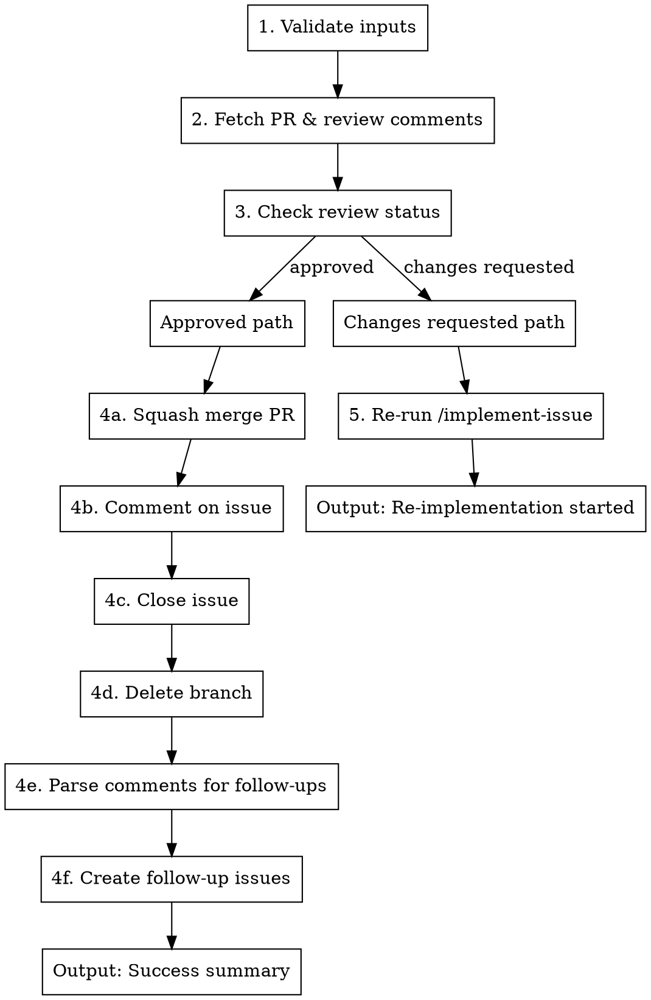

# Process PR

Read PR review comments and act accordingly: if approved, create follow-up issues and merge; if changes requested, re-run implementation.

**Announce at start:** "Using process-pr to process PR #$1 for issue #$2"

**Arguments:**
- `$1` — PR number (required)
- `$2` — Issue number that the PR addresses (required)
- `$3` — Base branch for re-implementation if needed (required)

**Examples:**
- `/process-pr 142 130 aw-next`
- `/process-pr 456 123 main`

## Process



**Why merge first:** Follow-up issues should only be created if the merge succeeds. Creating issues before merge can leave orphaned issues if merge fails (conflict, permissions, etc.). Merging first ensures we only create follow-ups for work that actually landed.

### Step 1: Validate Inputs

```bash
# Verify PR exists and is open
gh pr view $PR_NUMBER --json state,number,title,headRefName,reviews

# Verify issue exists and is open
gh issue view $ISSUE_NUMBER --json state,number,title
```

**If validation fails:** Stop and report error.

### Step 2: Fetch PR & Comments

```bash
# Get PR with comments
gh pr view $PR_NUMBER --json number,title,state,headRefName,comments

# Also get the full PR view with comments for parsing
gh pr view $PR_NUMBER --repo OWNER/REPO --comments
```

**Extract:**
- All PR comments (for review status and follow-up issue extraction)
- PR metadata (title, branch, state)

### Step 3: Parse Review Status from Comments

**IMPORTANT:** Review status is embedded in PR comments by the `implement-issue` skill. Use this explicit algorithm:

**Step 3a: Fetch all PR comments**

```bash
# Get comments as JSON array
COMMENTS=$(gh pr view $PR_NUMBER --json comments --jq '.comments[].body')
```

**Step 3b: Extract status from comments (most recent wins)**

```bash
# Parse status using explicit algorithm
parse_review_status() {
    local comments="$1"
    local status=""

    # Process comments in order (last one wins)
    while IFS= read -r comment; do
        # Check for markdown bold format first (preferred)
        if echo "$comment" | grep -q '\*\*Status: APPROVED\*\*'; then
            status="APPROVED"
        elif echo "$comment" | grep -q '\*\*Status: CHANGES_REQUESTED\*\*'; then
            status="CHANGES_REQUESTED"
        # Fallback to plain text format
        elif echo "$comment" | grep -q 'Status: APPROVED'; then
            status="APPROVED"
        elif echo "$comment" | grep -q 'Status: CHANGES_REQUESTED'; then
            status="CHANGES_REQUESTED"
        fi
    done <<< "$comments"

    echo "$status"
}

REVIEW_STATUS=$(parse_review_status "$COMMENTS")
```

**Step 3c: Validate status**

```bash
if [ -z "$REVIEW_STATUS" ]; then
    echo "ERROR: No review status found in PR #$PR_NUMBER comments"
    echo "Expected: Comment containing '**Status: APPROVED**' or '**Status: CHANGES_REQUESTED**'"
    exit 1
fi

echo "Review status: $REVIEW_STATUS"
```

**Status priority:**
1. `**Status: APPROVED**` (markdown bold - preferred)
2. `**Status: CHANGES_REQUESTED**` (markdown bold - preferred)
3. `Status: APPROVED` (plain text - fallback)
4. `Status: CHANGES_REQUESTED` (plain text - fallback)

**Multiple reviews:** The algorithm processes comments in chronological order. The LAST status found wins, representing the most recent review.

---

## If Approved: Merge Path

### Step 4a: Squash Merge PR

```bash
gh pr merge $PR_NUMBER \
  --squash \
  --delete-branch
```

**If merge fails:**
- Log error with reason
- Stop - do not proceed to close issue or create follow-ups
- Return failure status

### Step 4b: Comment on Issue

```bash
gh issue comment $ISSUE_NUMBER --body "$(cat <<'EOF'
## Completed

Resolved via PR #$PR_NUMBER (squash merged).

### Follow-up issues created:
- #XXX - Description
- #YYY - Description

(Or "No follow-up issues needed.")
EOF
)"
```

### Step 4c: Close Issue

```bash
gh issue close $ISSUE_NUMBER
```

Verify closure:
```bash
gh issue view $ISSUE_NUMBER --json state
```

### Step 4d: Delete Branch

The `--delete-branch` flag handles this. Verify:

```bash
git ls-remote --heads origin $BRANCH_NAME
```

If still exists:
```bash
git push origin --delete $BRANCH_NAME
```

### Step 4e: Parse Comments for Follow-up Issues

Scan all review comments for indicators of follow-up work:

**Trigger phrases:**
- "create issue for..."
- "follow-up needed:"
- "out of scope but should..."
- "technical debt:"
- "future improvement:"
- "TODO:" (in comments, not code)
- "nice to have:"
- "consider adding:"

**Extract for each:**
- Title (short description)
- Body (full context from comment)
- Labels (inferred: bug, enhancement, tech-debt)

### Step 4f: Create Follow-up Issues

For each extracted issue:

```bash
gh issue create \
  --repo OWNER/REPO \
  --title "$ISSUE_TITLE" \
  --body "$(cat <<'EOF'
## Context
Created from code review of PR #$PR_NUMBER (Issue #$ISSUE_NUMBER)

## Description
$EXTRACTED_DESCRIPTION

## References
- Parent Issue: #$ISSUE_NUMBER
- PR: #$PR_NUMBER
- Reviewer: @$REVIEWER
EOF
)" \
  --label "$LABELS"
```

Log each: `Created follow-up issue #XXX: "$TITLE"`

---

## If Changes Requested: Re-implementation Path

### Step 5: Re-run implement-issue

When the code reviewer requests changes, spawn a new implementation session:

```bash
claude --dangerously-skip-permissions \
  --print \
  "/implement-issue $ISSUE_NUMBER $BASE_BRANCH" \
  2>&1 | tee -a logs/process-pr-rerun-$(date +%Y%m%d-%H%M%S).log
```

**Notes:**
- The implement-issue skill will:
  - Read the existing PR and review comments
  - Address the requested changes
  - Push to the same branch (updating the PR)
  - Run code review again
- After implement-issue completes, call `/process-pr` again to check the new review

**Log:**
```
Changes requested on PR #$PR_NUMBER. Re-running implementation for issue #$ISSUE_NUMBER...
```

---

## Output

### Success (Approved & Merged)

```
## Process PR Complete

**PR:** #$PR_NUMBER
**Issue:** #$ISSUE_NUMBER
**Status:** ✅ Merged

### Actions Taken
- [x] Review status: APPROVED
- [x] Created N follow-up issues
- [x] PR squash merged
- [x] Issue #$ISSUE_NUMBER closed
- [x] Branch deleted

### Follow-up Issues Created
| Issue | Title | Labels |
|-------|-------|--------|
| #XXX | Description | enhancement |
```

### Re-implementation (Changes Requested)

```
## Process PR: Changes Requested

**PR:** #$PR_NUMBER
**Issue:** #$ISSUE_NUMBER
**Status:** 🔄 Re-implementing

### Review Feedback
$REVIEW_COMMENTS_SUMMARY

### Action
Re-running /implement-issue $ISSUE_NUMBER $BASE_BRANCH to address requested changes.
```

## Error Handling

| Failure Point | Action |
|---------------|--------|
| Validation fails | Stop, report error |
| No review status in comments | Stop, report - need code review comment with Status line first |
| Issue creation fails | Log warning, continue |
| Merge fails | Stop, return failure, do NOT close issue |
| Issue close fails | Log warning (merge succeeded) |
| Branch delete fails | Log warning (best-effort) |
| Re-implementation fails | Log error, include in output |

## Integration

**Called by:**
- `handle-issues` skill (after implement-issue creates PR)
- User directly via `/process-pr <pr> <issue> <branch>`

**Calls:**
- `/implement-issue` (when changes requested)

**Requires:**
- `gh` CLI authenticated
- PR must exist with a code review comment containing `**Status: APPROVED**` or `**Status: CHANGES_REQUESTED**`
- Issue must exist and be open

## Example Sessions

### Approved PR

```
User: /process-pr 142 130 aw-next

Claude: Using process-pr to process PR #142 for issue #130

Validating... PR #142 open, Issue #130 open
Parsing comments... Status: APPROVED, 1 follow-up found
Creating issue #145: "Add rate limiting to auth endpoint"
Merging PR #142... Squash merge successful
Closing issue #130... done
Deleting branch issue-130-auth-redirect... done

## Process PR Complete
PR: #142 | Issue: #130 | Status: Merged
Follow-up: #145 - Add rate limiting to auth endpoint
```

### Changes Requested

```
User: /process-pr 142 130 aw-next

Claude: Using process-pr to process PR #142 for issue #130

Validating... PR #142 open, Issue #130 open
Parsing comments... Status: CHANGES_REQUESTED
Feedback: "Need to handle edge case when session expires"

Re-running /implement-issue 130 aw-next...
[spawns headless session]
```

## Machine-Readable Result Output

When invoked via `batch-orchestrator.sh` with `--json-schema`, this skill's output is parsed for structured data. To ensure reliable extraction, **always end your execution with a clear result statement**.

### Final Result Output

At the **very end** of execution, output a clear status summary. This helps `--json-schema` reliably extract the structured output.

**On successful merge:**
```
## Result

Status: merged
Follow-up issues: #145, #146
```

**On merge with no follow-ups:**
```
## Result

Status: merged
Follow-up issues: none
```

**On changes requested:**
```
## Result

Status: changes_requested
```

**On error:**
```
## Result

Status: error
Error: Merge failed - conflict with base branch
```

**On rate limit:**
```
## Result

Status: rate_limit
Error: GitHub API rate limit exceeded
```

### Result Schema

The `batch-orchestrator.sh` uses this JSON schema to extract results:

```json
{
  "type": "object",
  "properties": {
    "status": {"enum": ["merged", "changes_requested", "error", "rate_limit"]},
    "follow_up_issues": {"type": "array", "items": {"type": "integer"}},
    "error": {"type": "string"}
  },
  "required": ["status"]
}
```

**Important:** The final result section must be the last significant output. The `--json-schema` flag asks Claude to summarize the execution according to this schema, so ending with a clear status makes extraction reliable.
