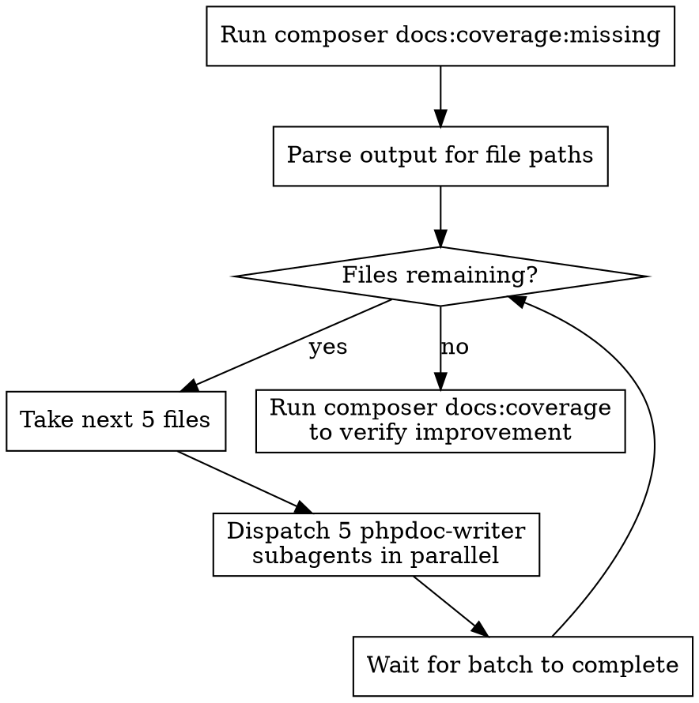

# Write Docblocks

## Overview

Batch-process PHPDoc documentation gaps by running `composer docs:coverage:missing` and dispatching parallel phpdoc-writer subagents.

**Core principle:** Process files in batches of 5 subagents for efficient parallel documentation without overwhelming the system.

## When to Use

- Documentation coverage below target (80% classes, 75% methods)
- After creating multiple new services, controllers, or models
- When `composer docs:coverage:missing` shows many files needing docs
- User requests batch PHPDoc writing

## Workflow



## Execution Steps

### 1. Get Missing Files

```bash
composer docs:coverage:missing 2>&1 | sed 's/\x1b\[[0-9;]*m//g' | grep '\.php$'
```

This strips ANSI codes and extracts just file paths like:
```
Console/Commands/ProcessDataCommand.php
Http/Controllers/AuthController.php
Services/AuthService.php
```

### 2. Process in Batches of 5

For each batch of 5 files, dispatch phpdoc-writer subagents **in parallel using a single message with multiple Task tool calls**:

```
Task(subagent_type="phpdoc-writer", prompt="Write PHPDoc blocks for app/Console/Commands/ProcessDataCommand.php - read the file, understand its purpose, and add comprehensive docblocks for the class and all undocumented methods.")

Task(subagent_type="phpdoc-writer", prompt="Write PHPDoc blocks for app/Http/Controllers/OAuthController.php - read the file, understand its purpose, and add comprehensive docblocks for the class and all undocumented methods.")

// ... 3 more in same message
```

**CRITICAL:** All 5 Task calls MUST be in a single assistant message to run in parallel.

### 3. Wait for Batch Completion

Wait for all 5 subagents to complete before starting the next batch. This prevents resource exhaustion while maintaining parallelism.

### 4. Repeat Until Done

Continue processing batches until all files are documented.

### 5. Verify Coverage

```bash
composer docs:coverage
```

Confirm improvement toward targets (80% classes, 75% methods).

## Subagent Prompt Template

```
Write PHPDoc blocks for app/{PATH}

1. Read the file thoroughly to understand its purpose
2. Check what's already documented vs missing
3. Add comprehensive docblocks for:
   - Class-level documentation explaining purpose and context
   - All undocumented public methods with @param, @return, @throws
   - Protected/private methods with brief explanations
4. Follow project-specific conventions and domain terminology
5. Run pint after editing: ./vendor/bin/pint {file}

Target audience: New developer on their first day.
```

## Common Mistakes

**Dispatching sequentially:** Each file one at a time wastes time. Use batches of 5 in parallel.

**Not using single message:** Multiple Task calls in separate messages run sequentially. Put all 5 in ONE message.

**Skipping verification:** Always run `composer docs:coverage` at the end to confirm improvement.

**Forgetting pint:** Subagents should run `./vendor/bin/pint` after editing to maintain code style.
